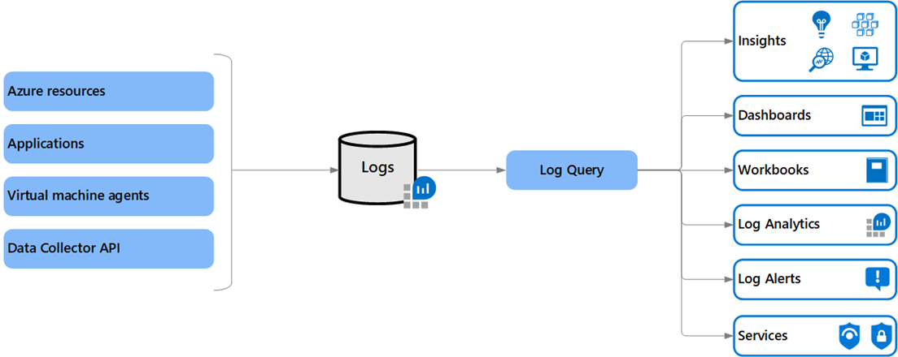
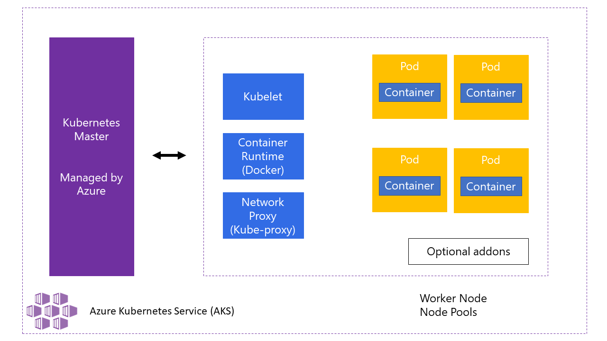
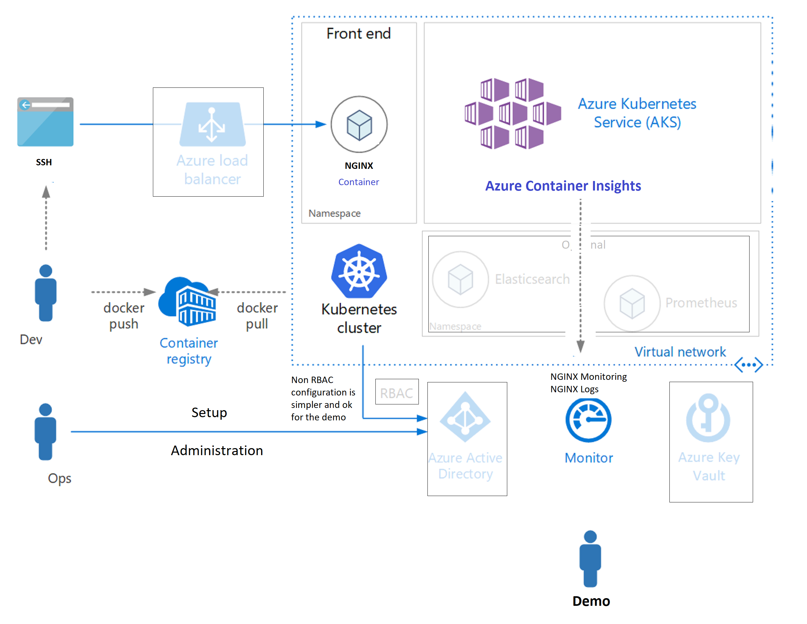
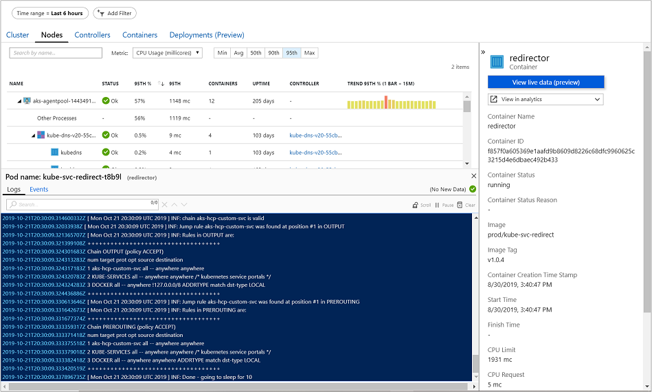
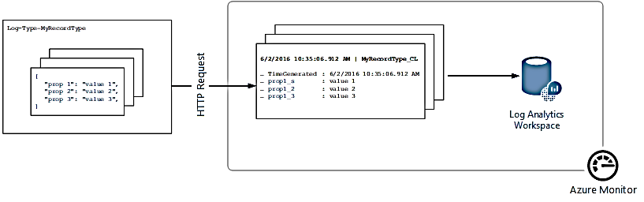

## Azure Monitoring Services

<!-- https://youtu.be/kJjBr0ppPy0 -->

Azure has a [complex landscape of Logging and Monitoring](https://youtu.be/Zr7LcSr6Ooo) end-points aka "services".

Primary audience (customers) are projects delivering new code, developed from scratch for Azure Web Applications with numerous micro services running in the back implemented as Azure Functions.

Legacy applications file/console logs are called "ad hoc loggin data" and are neither natural nor easy to setup and use, compared to Amazon WS or Google Cloud.

Syslog, ELK, Splunk, Datadog etc, are very present on the Azure market, as feasible alternatives delivered as separate services.

## Azure Kubernetes Services (AKS) Containerized App's logging

AKS is deployment of full Kubernetes clusters where only the k8s "control plane" is managed by Azure infrastructure

Please note, the Container Runtime will be not contain "Docker runtime" as of April 2023.

Of course, number of "Pods" per "Node" is decided by k8s as per k8s configurstion. Roighly one "Node" is one VM. 

Here is one very "simple" AKS deployment, assembled for demo purposes:
<!-- 
 -->

Out of the box (OOB) AKS uses so called "Container insights" concept and mechanism. Container insights primary reason of existence is advanced diagnostic feature allowing [direct access to AKS container logs (stdout/stderror), events, and pod metrics](https://docs.microsoft.com/en-us/azure/azure-monitor/containers/container-insights-livedata-overview). 

It exposes direct access to the k8s cli (few examples): `kubectl logs -c`, `kubectl get events`, and `kubectl top pods`. Please note: these are k8s, not docker runtime commands. Docker is being deprecated.

Azure console dashboard shows the logs, events, and metrics generated by the container engine for further assistance in troubleshooting issues in real-time.

### Operational Issues

- That meachanism intended primary usage is for Monitoring; it is described as: *Viewing real-time log data as they are generated by the container engine from the Nodes, Controllers, and Containers view*. 
  - Any Teams wishing to view their logs, will need acces to live (or live-test) AKS installation.
- Usability of that solution is somewhat moot point too.
  - Azure portal is by default accessible only to a limited number of Azure administrators 
  - That screen above is not just another web site. Access to it is most often highly controlled
- The whole solution might require establishing separate FA k8s cluster operators and users groups and authorizations for different roles, with good knowledge on integration with company AAD (Azure AD).
- There are no Azure Container log drivers matching [Amazon Cloud Watch loggin driver](https://docs.docker.com/config/containers/logging/awslogs/), for example.

## Windows Containers  

<!-- https://samcogan.com/windows-containers-and-azure -->

Linux containers exist for decades as `chroot`; [exclusive Linux feature](https://en.wikipedia.org/wiki/Chroot). Windows continers are very different vs Linux containers. Windows containers are recommended for situations where project must run the containerized application on Windows Servers or built as Windows binaries. 

There are some key limitations to Windows containers.

- **Size**: smallest usefull Windows container is around 3GB. 
- Exact **OS Version**: Windows containers do require that the host machine is running the same version of Windows as it is inside the container. Not the same family, but the same version. If host is running Server 2016 v1803, then containers also need to run Server 2016 v1803, not v1709. This is very problematic as it means rebuilding images any time host OS changes. For those trying to use cloud providers, users won’t know what OS is running on the machines windows containers will be running on. 
  - One can combat this issue by running Windows containers as HyperV containers, which wraps container in a thin virtual machine to abstract it from the OS. 
  - This adds complexity and it is not certain what are the Azure services and requiremenrs necessary

- **AKS**: what version and build number is required for Windows containers running on AKS seems to be a moving target.
  - In May 2019 AKS for Windows Containers was in "preview mode"
  - It seems Windows Server 2022 is in the focus 2022Q2, of the Azure (AKS) development team
    - Just before that it was Windows Server 2019
- **ACI** (Azure Container Instances): ACI is container as a service platform, which allows projects to create a container as a top-level resource in Azure quickly. There is no need to manage underlying VMs or an orchestrator.
  - Limitations to be aware of
    - ACI is more expensive than running a VM of the same size. ACI is intended for burst workloads that are running for short periods. ACI instance 24/7, will cost more than running a VM of the same size (but project don’t need to worry about the underlying VM management)
    - When launching an ACI, system need to download the container image; there is no caching of images. That means the large size of Windows containers can become a problem, especially if system is regularly killing and recreating instances. Each time system does that the image is re-downloaded.
    - Windows Containers on ACI do not currently support joining a virtual network. 
      - One can do this with Linux CI instances, but not Windows.
- **Azure Service Fabric** is a Azure platform recommended for Micro Services built Azure applications
  - To run Windows containers in production today, with them joined to a virtual network, the only option that ticks all these boxes is Service Fabric (SF). SF is Microsoft’s microservices platform which can host both executables and containers. It supports both Linux and Windows containers (but not in the same cluster).
    - Service Fabric is a “PaaS like” solution, like AKS, where it is still deploying IaaS VM’s but with easy ways to manage and update them. 
      - Teams are still responsible for managing and administrating those machines. 

### Situation 2022Q2

Circa 2022Q2, customers can choose from Azure Container Instances, Service Fabric managed clusters, or Azure Kubernetes Service to migrate their on premises workloads. 

- Customers that want to deploy serverless containers quickly and easily would benefit from Azure Container Instances. 
- Customers that want additional control over their environment would benefit from Azure Kubernetes Service which offers an industry leading managed Kubernetes offering. 
- Lastly, customers who want all the richness that comes with Service Fabric such as stateful programming models can use Service Fabric managed clusters which offer the entire Service Fabric feature set with reduced cluster management overhead. 

### Native Azure and Container Logs 

Microsoft Azure by default, without Kubernetes (AKS), has many monitoring options to choose from, making it difficult to decide which ones to rely on to track workloads and performance demands. Outside of AKS, Azure does offer extensive monitoring capabilities, a bit less extensive logging, while "ad hoc logging" from inside Containers seems very difficult to use, compared to AWS and Google Clouds. ["Data Collector API"](https://docs.microsoft.com/en-us/azure/azure-monitor/logs/data-collector-api) is the current solution (in perpetual preview status) for sending "Ad hoc" logs to Azure. 

The key issue with that is: [users need to define a custom record type](https://docs.microsoft.com/en-us/azure/azure-monitor/logs/data-collector-api) when submitting data through the (Azure Monitor HTTP) Data Collector API. Currently, users can't write data to existing record types that were created by "normal" data types and solutions.

That solution requires new code to be written (not in C++) and it is not using Container logs.

If inside a container, code using "Data Collector API" will be connecting to Azure over HTTP REST calls, bypasing container logs. There are no Azure Docker log drivers matching [Amazon Cloud Watch loggin driver](https://docs.docker.com/config/containers/logging/awslogs/), for example.

## 2022Q2 AKS Periscope

[Please see here](https://github.com/Azure/aks-periscope#readme).

[AKS Periscope](https://github.com/Azure/aks-periscope) is an open source Kubernetes Agent, owned by Microsoft.

From March 2022 Azure AKS Periscope usability is much improved and VS Code extension developed and updated specialy for its usage by developers has been released

Instead od producing zip-ed log files for download, as originaly was the case, AKS Periscope now writes the logs into the Azure Storage, of choice. Using the Azure Storage Account.

For development and testing purpose this might be the preffered method. Especialy if VS Code is part of the developers toolkit.
