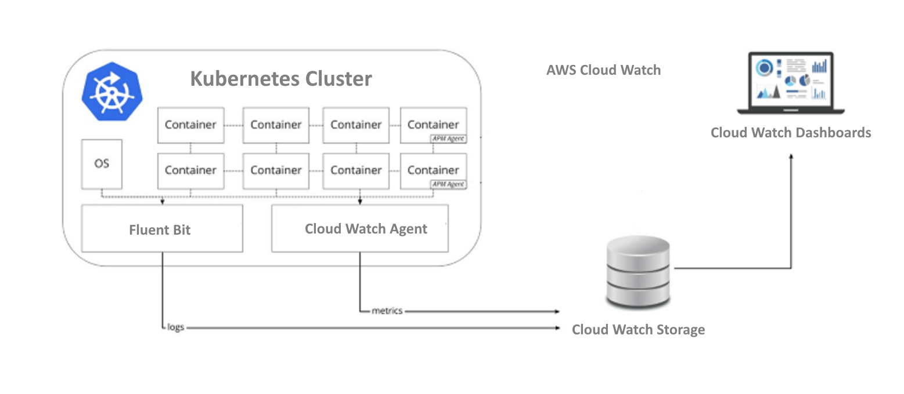
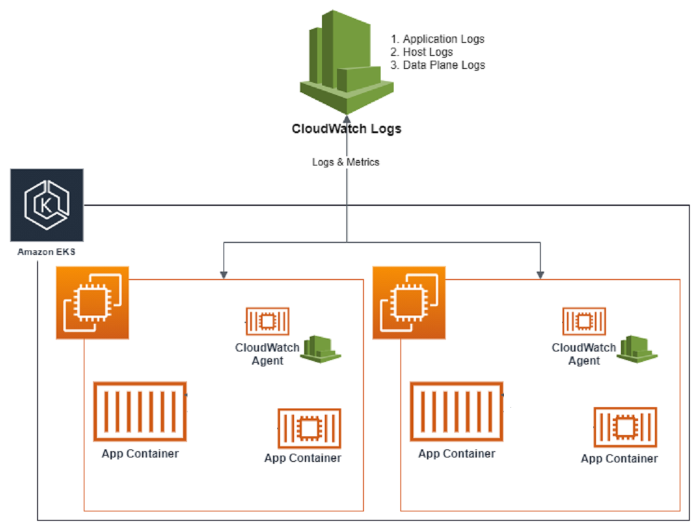
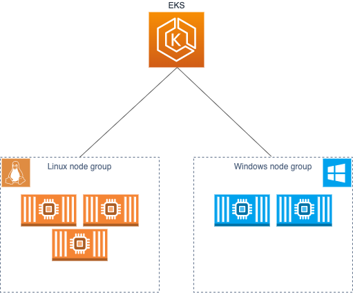

## AWS Cloud Watch Logging for Amazon EKS

CloudWatch collects monitoring and operational data in the form of logs, metrics, and events. That is how AWS dash boards offer complete visibility resources, applications, and services running on AWS and on-premises.



### Mechanism to captured and send to Cloud Watch
- Agent: CW Container Insights implements cluster, node, and pod-level metrics with the CloudWatch agent.
- EKS uses Fluent Bit or [Fluentd](https://www.fluentd.org/architecture) for log capture to CloudWatch.
  - Docker offers OTB Fluentd logging driver

If users don’t want to use Container Insights with Fluent Bit or Fluentd for logging, users can capture node and container logs with the CloudWatch agent installed on Amazon EKS nodes. Docker also has OTB [CloudWatch logging driver](https://docs.docker.com/config/containers/logging/awslogs/) 

The awslogs logging driver sends container logs to Amazon CloudWatch Logs. Log entries can be retrieved through the AWS Management Console or the AWS SDKs and Command Line Tools.



### Risks

It seems AWS logging driver works only while container is running on the EKS on the Amazon cloud. This is its sample configuration:
```
{
  "log-driver": "awslogs",
  "log-opts": {
    "awslogs-region": "us-east-1"
  }
}
```
That configuration probably can not run on the developers laptop.

[It is not clear but it is likely](https://docs.aws.amazon.com/prescriptive-guidance/latest/implementing-logging-monitoring-cloudwatch/kubernetes-eks-logging.html), docker container Cloud Wach driver communicates with the CW agent on the k8s node on which it runs.

### EKS and Windows Containers

<!-- https://www.eksworkshop.com/beginner/300_windows/ -->

EKS Windows containers have to be in a separate node group.



It has to be thoroughly investigated what are the problem details (if any) while trying to read the logs from [Windows containers residing on EKS](https://aws.amazon.com/blogs/containers/streaming-logs-from-amazon-eks-windows-pods-to-amazon-cloudwatch-logs-using-fluentd/).

The kubelet and kube-proxy event logs are redirected to the EKS Windows Event Log and are set to a 200 MB limit. That is not custom application logs.

[Proceed here ](https://aws.amazon.com/blogs/containers/streaming-logs-from-amazon-eks-windows-pods-to-amazon-cloudwatch-logs-using-fluentd/)for full AWS setup and test.


<div style="page-break-after: always;"></div>

:[ecs](./aws/aws_cloudwatch.md)