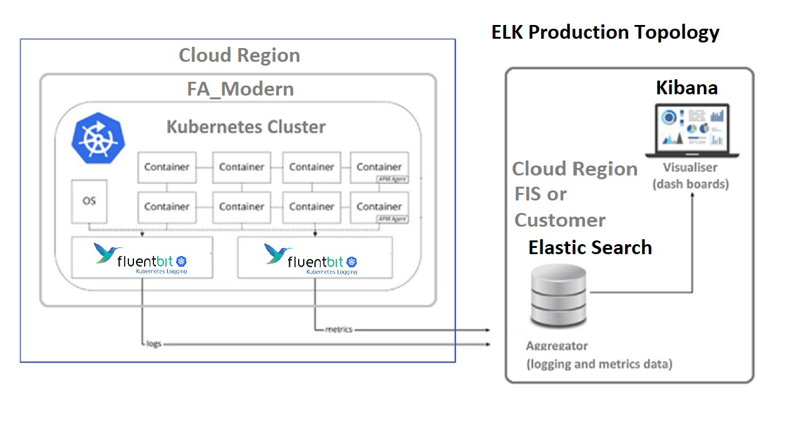

## ELK aka Elastic Search and Kibana

<!-- https://itnext.io/deploy-elastic-stack-on-kubernetes-1-15-using-helm-v3-9105653c7c8 -->
The Elastic Stack (also known as ELK) integrates natively with Kubernetes and is a popular open-source solution for collecting, storing and analyzing Kubernetes telemetry data and application logs.

Overview of the Option of the standard Modern FA Logging Prouction Architecture 

1. Logs: Server logs to be analyzed are identified
1. Logstash: Data aggregation and processing
1. Elasticsearch: Indexing and storage
1. Kibana: Analysis and visialization

### Elasticsearch on Kubernetes

According to Elastic, (a company brhind ELK stack), these are just a few of the benefitss:
- Straightforward deployment and management of multiple Elasticsearch clusters, including Kibana
- Seamless upgrades to new versions of the Elastic Stack
- Simple scaling that allows you to grow with your use cases
- Default security on every cluster

Elastic provide the option to have the Elasticsearch & Kibana on Kubernetes running on the Elastic Cloud managed solution.

Iin that scenario there are two ELK related agents on each Kubernetes node.

- [Filebeat](https://www.elastic.co/beats/filebeat) is a lightweight shipper for forwarding and centralizing log data. Installed as an agent on nodes, monitors the log files or locations.
  - [Filebeat for Kubernetes](https://www.elastic.co/guide/en/beats/filebeat/current/running-on-docker.html) is a Docker image.
- [Metricbeat](https://www.elastic.co/guide/en/beats/metricbeat/current/metricbeat-installation-configuration.html) monitors k8s nodes and the pods they host by collecting metrics from the operating system and services.
  - [k8s Metricbeat agent](https://www.elastic.co/gimplmenteduide/en/beats/metricbeat/current/running-on-kubernetes.html) is implemented as a Docker Image.

### ELK on AKS or EKS
There is a number of vendors offering ELK management and integration with AKS or EKS clusters.
