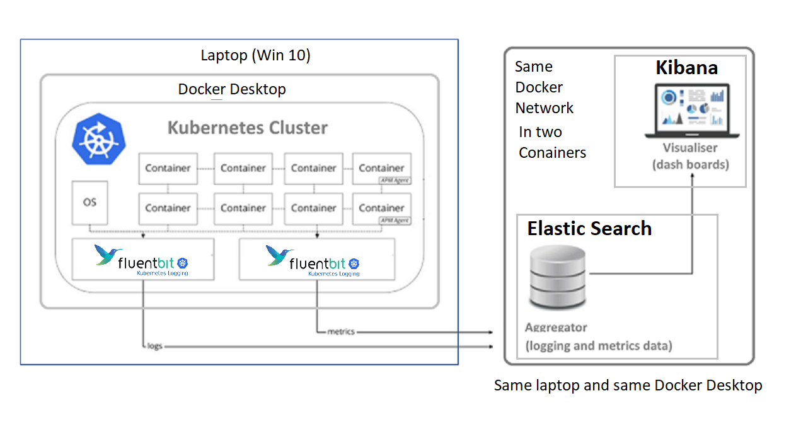
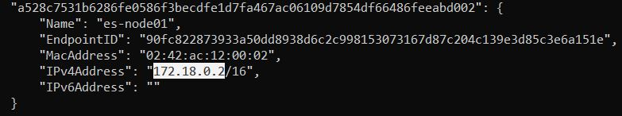
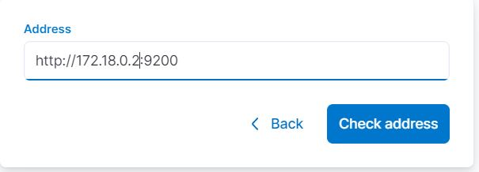
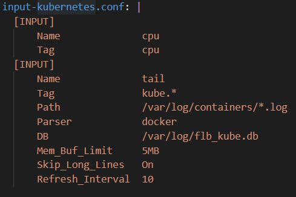
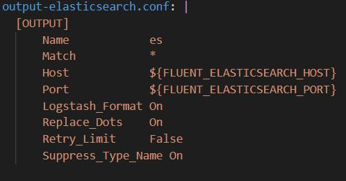
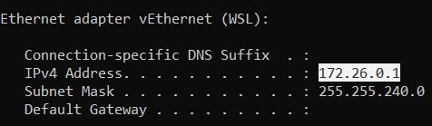
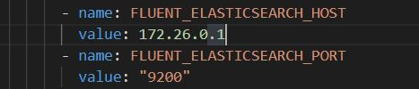
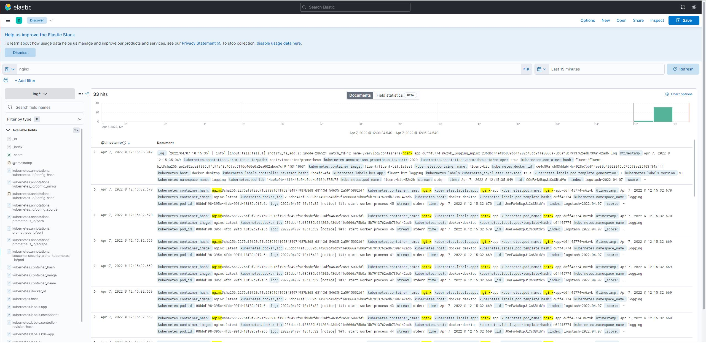

## Demoing FluentBit, Elasticsearch and Kibana 

Overview of the Demo Topology



## Configuration

To run these two tls need to be off in elasticsearch

Next command's will run Elasticsearch and Kibana  without tls
```
docker run --name es-node01 --net elastic -p 9200:9200 -e ELASTIC_PASSWORD=password -e xpack.security.enabled=false -e discovery.type=single-node -p 9300:9300 -t docker.elastic.co/elasticsearch/elasticsearch:8.1.1

docker run --name kib-01 --net elastic -p 5601:5601 docker.elastic.co/kibana/kibana:8.1.1
```
Access to Kibana is with `http://localhost:5601` and select to configure it manually.

Get IP of the container where the elastic resides, with following:
```
docker network inspect elastic
```


And then put that address in kibana web app, configuration window:



`9200` is the default ELastic Search port.

## FluentBit Configuration

Run next sequence of commands from windows cli.
```
kubectl create namespace logging
```
Please note above we have declared name space called `logging`.

```
kubectl create -f https://raw.githubusercontent.com/fluent/fluent-bit-kubernetes-logging/master/fluent-bit-service-account.yaml

kubectl create -f https://raw.githubusercontent.com/fluent/fluent-bit-kubernetes-logging/master/fluent-bit-role-1.22.yaml

kubectl create -f https://raw.githubusercontent.com/fluent/fluent-bit-kubernetes-logging/master/fluent-bit-role-binding-1.22.yaml

kubectl create -f fluent-bit-config-map.yaml
```

Where fluent-bit-config-map.yaml contains configuration for input, output FluentBit plugins, etc. :


    

With windows ipconfig command, obtain wsl IP address



Then paste that IP in the `fluent-bit-app.yaml`:



And then run next command, from windows CLI:
```
kubectl create -f fluent-bit-app.yaml
```
## Getting Logs from Container

First we do deploy some container into the same logging namespace, we named `logging` above:
```
kubectl create deployment --image=nginx --namespace=logging nginx-app
```
Now using the kibana web front, we can view the logs: 


