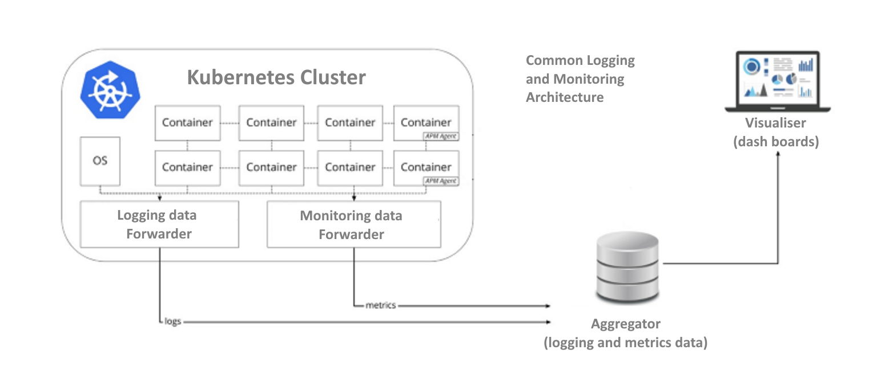
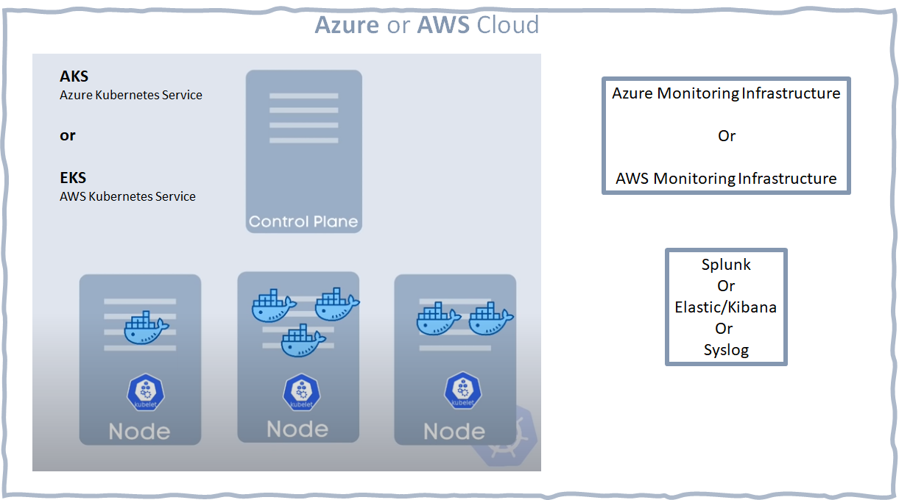

## Runtime 

- Cloud
  - Azure or AWS
- Kubernetes (k8s)
  - AKS or EKS
- Docker Containers
  - Linux and Windows 

Those are key constraints shaping up the research and suggested solutions. This is the base common architecture for logging and monitoring Kubernetes clusters

Please note: Docker runtime usage is deprecated in Kubernetes. 2022 Apr release will not contain Docker runtime. End date for supporting Docker runtime is Apr 2023.

## What are Agents and Forwarders

Often Monitoring and Logging Collecting and Forwarding components is called "Forwarder" or "Collector".

The Forwarder consists of a single binary and two primary deployment methods:

- **Agent**: A Forwarder instance running with the application or on the same host as the application (e.g. binary, sidecar, or daemonset).
  - This is the model recommended abd deployed by Kubernetes  
- **Aggregator**: One or more Forwarder instances running as a standalone service (e.g. container or deployment) typically per cluster, data center or region.
  
### Agent
It is recommended to deploy the Agent on every host within an environment. In doing so, the Agent is capable of receiving telemetry data (push and pull based) as well as enhancing telemetry data with metadata such as custom tags or infrastructure information. In addition, the Agent can offload responsibilities that client instrumentation would otherwise need to handle including batching, retry, encryption, compression and more. Instrumentation libraries by default export their data assuming a locally running Collector is available.

### Aggregator
Additionally, a Aggregator can be deployed for every cluster, data center, or region. A Aggregator runs as a standalone service and can offer advanced capabilities over the Agent including tail-based sampling. In addition, a Aggregator can limit the number of points required to send data as well as consolidate API management. Each Aggregator instance can be in a cluster, so it operates independently and it is easy to scale the architecture based on performance needs with a simple load balancer. If a Aggregator cluster is deployed, it usually receives data from Agents deployed within an cluster.

**Kubernetes (k8s) terminology**

For quick play with k8s [please see here](https://labs.play-with-k8s.com).

Simple diagram depicting core Kubernetes terminology in the context of AKS/EKS.

- Container is inside a k8s "Pod" (a little blue "whales" on the diagram)
  - pod is a logical construct grouping containers
  - usualy one container is logicaly "inside" one pod
- "Pod's" are inside "Nodes"
  - Node is a logical construct
  - usualy one k8s Node is mapped onto one VM
- "Nodes" are controled by k8s "Control plane" aka "Controler" (sometimes "Master")
- k8s "Cluster" is seen by users as made of Containers
  - thus "Pods" and "Nodes" are transparent
  - k8s clusters in both AKS abd EKS are the same as as stand alone k8s, it is a Control Plane that is managed by using k8s API.

Clarifications

- reason of existence of Kubernetes is deploying large applications based on the [Microservice architecture](https://en.wikipedia.org/wiki/Microservices), onto the Cloud infrastructure 
- k8s controls the k8s topology physical partitioning
  - meaning: number of VM's and Containers is transparent, 1 .. N
- One node is usualy one VM as a recommendation
- By default Nodes and Pods "appear and disappear" dynamicaly
  - Nodes contain Pods only logicaly  
    - Pod is abstraction, it logicaly "contains" Containers
      - recommendation is `1 : 1`; one pod one container

### k8s to Logging / Monitoring

Kubernetes logging can be divided into control plane logging, node logging, and application logging. The Kubernetes control plane is a set of components that manage Kubernetes clusters and produce logs used for auditing and diagnostic purposes.

Kubernetes also runs system components such as `kubelet` and `kube-proxy` on each Kubernetes node that runs pods. These components write logs within each node. 

Both AKS (Azure k8s) and EKS (Amazin k8s) do offer and contain k8s Monitoring and Logging with numerous dash boards. Primarily oriented towards Administrator and Operators Monitoring requirements. End users never have access to administration portals of AKS or EKS.

Legacy Logging is called "custom logs" and is forwarded as separate data to the final destination. 

Syslog is standard logging infrastructure. Every Cloud infrastructure does contain syslog infrastructure. Third party monitoring/logging providers do use that too. 

### Side note: The Deprecation of a Docker Runtime

<!-- https://semaphoreci.com/blog/kubernetes-vs-docker -->

*Docker support in the kubelet is now deprecated and will be removed in a future release.*

EOF 2021 Kubernetes development team announced they are [deprecating Docker support](https://github.com/kubernetes/kubernetes/blob/master/CHANGELOG/CHANGELOG-1.20.md#deprecation).

[Kubernetes is Moving away from Dockershim, on April 2022](https://kubernetes.io/blog/2022/01/07/kubernetes-is-moving-on-from-dockershim/): Commitments and Next Steps.

("Dockershim" is a process through which Kubernetes is communicating with Docker runtime aka `dockerd`. Support will last for one year after Apr 2022.)

Docker runtime is made of two parts:

1. dockerd
   1. Manages: Network, API, Storage, Images, Builds
2. containerd
   1. Manages Container

Why the Docker runtime removal (deprecation):

1. Kubernetes wants to support and run any container conforming to the OCI ( [Open Container Initiative ](https://opencontainers.org/)) 
1. Not just Docker specific containers

The result is less bloat and fewer dependencies.

### Why do we care?

If using managed k8s cluster on a cloud provider like AWS EKS, Google GKE, or Azure AKS, projects need to check AKS,EKS runtime Docker dependancy before Docker support goes away. 

For example: k8s support "Container Insights" and that include `stdout`/`stderr` of containers. It is a moot point how will reading the Docker Container logs be affected on AKS or EKS. Do they (and how much) depend on Docker runtime that will be removed? 

<!-- div class="page"/ -->

