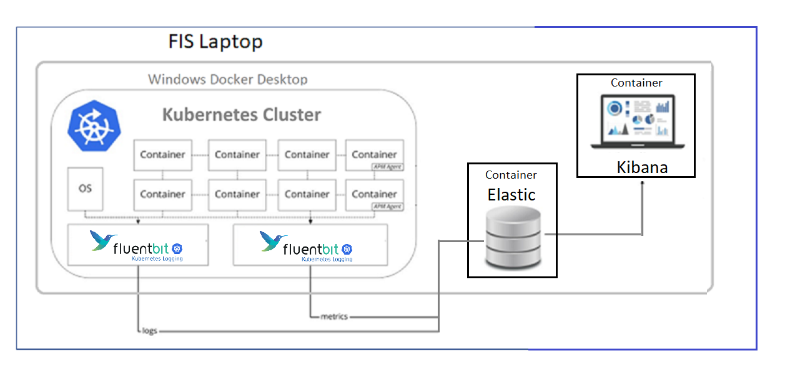
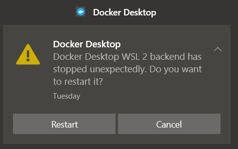
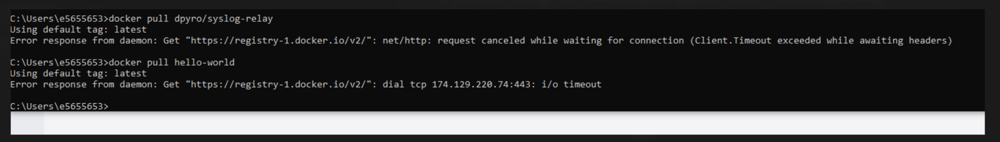
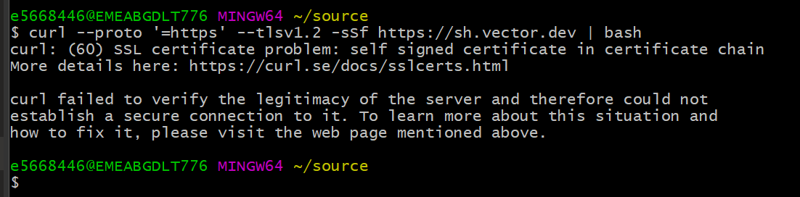

<!-- Author: dusan.jovanovic@fisglobal.com -->
> Version 2022-03-23-WORK_IN_PROGRESS
- [1. Modern FA Logging Research Demo](#1-modern-fa-logging-research-demo)
  - [1.1. Why using FluentBit, Logging and Monitoring data collector and forwarder?](#11-why-using-fluentbit-logging-and-monitoring-data-collector-and-forwarder)
  - [1.2. Setup](#12-setup)
    - [1.2.1. Requirements](#121-requirements)
    - [1.2.2. **Syslog**](#122-syslog)
    - [1.2.3. **Cloud Watch**](#123-cloud-watch)
    - [1.2.4. **Splunk**](#124-splunk)
    - [1.2.5. **ELK**](#125-elk)
  - [1.3. Appendix: WIndows Server VM's](#13-appendix-windows-server-vms)
  - [1.4. Appendix: Laptop Setup issues](#14-appendix-laptop-setup-issues)
    - [1.4.1. A](#141-a)
    - [1.4.2. B](#142-b)
    - [1.4.3. C](#143-c)
    - [1.4.4. D](#144-d)
  - [1.5. Appendix: Sidecar Pattern](#15-appendix-sidecar-pattern)
  
# 1. Modern FA Logging Research Demo


Demo will spread across three standard FIS laptops. This is the common architecture.

Note: Same architecture is applicable for the "real" k8s cluster in the cloud. Two fluent bit instances are for production installation. Monitoring traffic is much more frequent vs the logging data forwarding.


## 1.1. Why using FluentBit, Logging and Monitoring data collector and forwarder?

Logging and monitoring the k8s cluster is not a trivial technology. Fluent Bit is used widely in production environments. In 2020 Fluent Bit was deployed more than 220 Million times, and continues to be deployed over 1 million times a day. 

<!--  -->


Why is that a challenge? One very good reason: network is not a transparent resource. Another is security: one has to minimize the number of connections to be secured. It is not very feasible to target Logging backend direct from every container logging driver for example.

**Fluent bit is collecting both k8s metadata and container logs**

<!--  -->


Core concept in Fluent Bit is one of "Plugins".

<!--  -->


NOTE: Plugins are "built-in".


Combination of input/output plugins is decided in the FluentBit configuration file.

<hr/>

[Please see the rest in this very short video](https://www.youtube.com/watch?v=B2IS-XS-cc0).

<div style="font-size:x-small">
(ps: yes Global Protect makes YouTube on your FIS laptop possible)
</div>
<hr/>

**Very simple configuration file sample**

Monitor the CPU and output the monitoring data to the ElasticSearch / Kibana.
```python
[INPUT]
# plugin name 'cpu' is for CPU monitoring
    Name  cpu
    Tag   cpu

[OUTPUT]
# plugin name "es" is for ELK output
    Name  es
    Match *
# elastic host IP    
    Host  192.168.2.3
# and port
    Port  9200
    Index my_index
    Type  my_type
```

After using the above configuration file (on startup), FluentBit agent is using k8s API to get the CPU monitoring data on the k8s Node hosting the FB agent.
Which are the transformed to ELK format and sent to the ElasticSeach on the machine installed as detiled in the configuration.

## 1.2. Setup

To setup k8s + FluentBit is [not a trivial task](https://echorand.me/posts/fluentbit-kubernetes/). Please make sure to follow and use the [FluentBit Official Manual](https://docs.fluentbit.io/manual/installation/kubernetes), as the first step.


### 1.2.1. Requirements 

  - By changing the FluentBit configuration we can demo different logging mechanisms.
    - Each laptop has to have Docker Desktop for Windows with Kubernetes switched on and running.
    - That Kubernetes cluster has to have FluentBeat installed and running. 
    - For a very quick help on Kubernetes cli please see: [Kubectl for Docker users](https://kubernetes.io/docs/reference/kubectl/docker-cli-to-kubectl/)

### 1.2.2. **Syslog**
  - the point of this is to show to differences of the syslog relay hiting the FluentBit in the same cluster or direct e.g. ELK local host. 
### 1.2.3. **Cloud Watch**
  - AWS solution
  - the point of this part is to understand the feasibility of CLoudWatch logging driver hitting local FluentBit or global AWS CW account. 
  - It is to be "discovered" what kind of installation is best in the context of a one-machine-demo
### 1.2.4. **Splunk**
  - Here we should have local Splunk installed locally, on the receiving side.
  - It is to be "discovered" what kind of installation is best in the context of a one-machine-demo
### 1.2.5. **ELK**
- Kibana & Elastic are installed in two containers following [these instructions](https://www.elastic.co/guide/en/kibana/8.1/docker.html#docker). On the same local Docker Desktop.



- Must start with [Elastic Search container](https://www.elastic.co/guide/en/elasticsearch/reference/8.1/docker.html)

Note: for the demo purposes second instalation of the FluentBit is not required. It is required for real life production installations to divide logs from monitoring. Momitoring data forwarding is much more frequent.
  
  <!-- - What are Elastic Beats
    -[Beats are open source data shippers](https://www.elastic.co/guide/en/beats/libbeat/8.1/beats-reference.html) installed as agents on servers to send operational data to Elasticsearch.
  - Elastic's own text on [how to run Filebeat on Kubernetes](https://www.elastic.co/guide/en/beats/filebeat/current/running-on-kubernetes.html)
  - Reminder: Filebeat Docker images on Kubernetes are deployed as [DaemonSet](https://kubernetes.io/docs/concepts/workloads/controllers/daemonset/) so they run as "Agents". 
  - **What is MetricBeat** 
    -  Metricbeat is a ELK made lightweight OS log data agent, that will be very likely required to install on our laptops.
    - It takes the metrics and statistics that it collects and ships them to the output specified, such as Elasticsearch.
    - MetricBeat in the case of W10 is a Windows Service, that has to be installed too; but not always and in all scenarios. For example local ELK in containers does require it.
      - It is to be "discovered" what kind of installation is best in the context of a one-machine-demo
      - In this demo if the requirement is for local ELK installation, thus Metrics Beat will be required -->
## 1.3. Appendix: WIndows Server VM's

AKS (Amazon Kubernetes Service) sample architecture


> Kubernetes users must separate Windows and Linux clusters. That is mandatory whoever is selling Kubernetes as a service.

- Windows Server 2019 (or 2022) Core VM
- Docker installed is for Windows Containers
  - Switching that to Linux containers is possible but seems like a [hack](https://petri.com/how-to-install-hyper-v-on-windows-server-core/)
- WinSvr VM Requirement is 4 CPU / 4GB RAM VM's, minimum
- [Windows Admin Center](https://docs.microsoft.com/en-us/windows-server/manage/windows-admin-center/overview) is necessary.
  
<!-- # Apendix A

Note: "observability" is the term in use to mean "logging and montitoring", in the context of containarised cloud hosted solutions. 

## Demo Alternatives

FluentBit based solutions are industrial strength production quality solutions, necessary for mission critical Cloud installations.

For specific limited scenarios, there are lighter and simpler alternatives based on exactly the same observability architecture. For the demo purposes, and such.

### Vector by [Timber.io](https://hub.docker.com/r/timberio/vector)


Vector is an open-source utility for building observability (aka logging and monitoring) pipelines. Collect, transform, and route log, metrics and events with one simple tool.


Vector places high-value on performance, correctness, and operator friendliness. It compiles to a single static binary and is designed to be deployed across your entire infrastructure, serving as a light-weight daemon, sidecar, or highly efficient service. -->

## 1.4. Appendix: Laptop Setup issues

Unrelated to any specific part of the logging technology chain. Few samples "from the trenches":

### 1.4.1. A


Cause unknown.

### 1.4.2. B


That one happened today (2022-03-18) on a laptop connected to LAN in the FIS BG Office. 

Developer had to connect to `redstripe` WiFi (in Belgrade office) in order to be able to work.

### 1.4.3. C



Trying to [install vector.io](https://vector.dev/docs/setup/installation/) in WFH situation. 

Very likely the same outcome will happen after trying to download and install using the [PowerShell + MSI solution](https://vector.dev/docs/setup/installation/package-managers/msi/).

### 1.4.4. D

Kibana trying to "call home":
```
[2022-03-22T10:46:41.277+00:00][ERROR][plugins.fleet] Error connecting to package registry: request to https://epr.elastic.co/categories?experimental=true&include_policy_templates=true&kibana.version=8.1.0 failed, reason: self signed certificate in certificate chain
```

More examples can be provided.

<!-- 
Link to [GROUP EMEA issues](https://fisglobal.sharepoint.com/:x:/t/GlobalProtectPathfinders/EflHSJYTPYdCkv6XqH30PcQBTG8j-1Cqola9qlw-UHM8ZQ?e=OZ29bk)
-->

## 1.5. Appendix: Sidecar Pattern

Please see here on: What is a [Sidecar Pattern](https://www.oreilly.com/library/view/designing-distributed-systems/9781491983638/ch02.html)

In its simplest form, a sidecar container can be used to add functionality to a container that might otherwise be difficult to improve.


