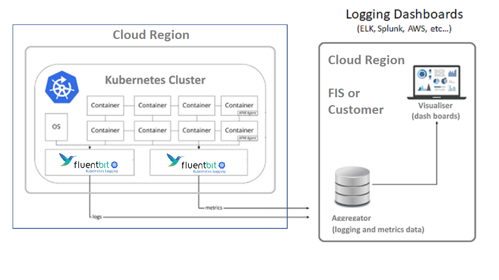
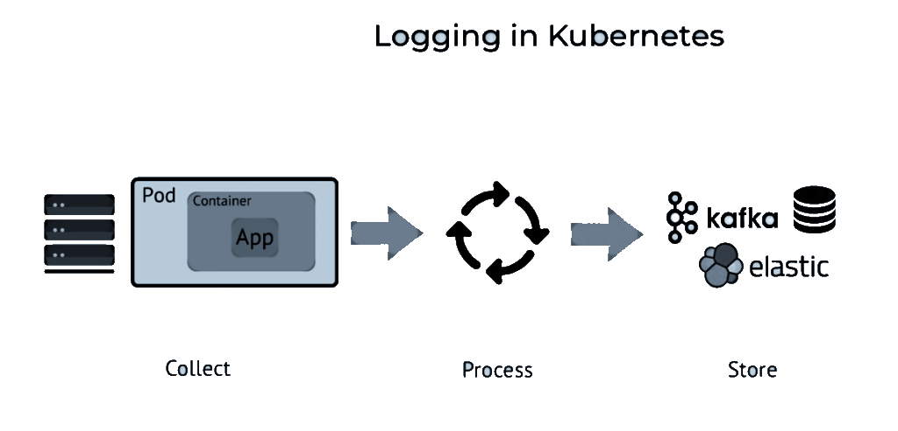
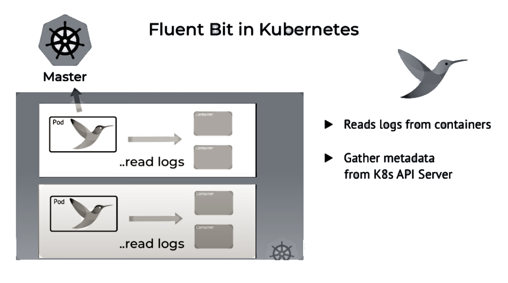
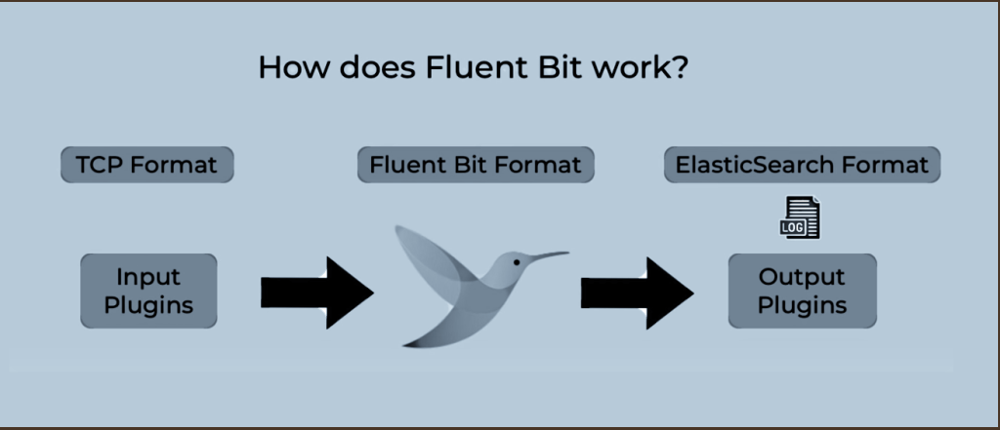
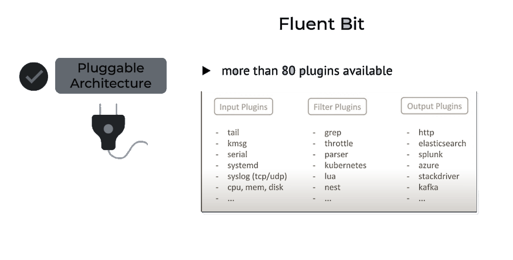

<!-- Author: dusan.jovanovic@fisglobal.com -->
> Version 2022-04-05-WORK_IN_PROGRESS
- [Why using FluentBit, Logging and Monitoring data collector and forwarder?](#why-using-fluentbit-logging-and-monitoring-data-collector-and-forwarder)
  
<h1>Modern FA Logging in a Production Environment</h1>

This is the common architecture applicable for the "production" Kubernetes (k8s) cluster in the cloud. k8s cluster contains two fluent bit instances installed as agents. Loging and monitoring are separated. Monitoring traffic is much more frequent vs the logging data forwarding.



FA Cluster and FA Monitoring and Logging Dash Boards are separated and thus independently changeable.

## Why using FluentBit, Logging and Monitoring data collector and forwarder?

Fluent Bit is used in k8s production environments worldwide. In 2020 Fluent Bit was deployed more than 220 Million times, and continues to be deployed over 1 million times a day. 

FluentBit is higlhy configurable and resilient, universal collector and forwarder. That fast much simpliefies the whole FA k8s deployment.

Still logging and monitoring the k8s cluster is not a trivial technology. 

<!--  -->


Why is that a challenge? Perhaps the key reason: network is not a transparent resource.  It is not very feasible to target Logging backend direct from every container (logging driver) and create very large number of network connections in the process. Also to be secured. Each cloud cluster has to minimize the number of in/out connections to be secured.

**Fluent bit is collecting both k8s metadata and container logs**

<!--  -->


Core concept in Fluent Bit is one of "Plugins".

<!--  -->


Plugins are "built-in". Fluent bit is a single container.



Combination of input/output plugins is decided in the FluentBit configuration file.

<hr/>

[Please see the rest in this very short video](https://www.youtube.com/watch?v=B2IS-XS-cc0).

<!-- <div style="font-size:x-small">
(ps: yes Global Protect makes YouTube on your FIS laptop possible)
</div> -->
<hr/>

**Very simple FB configuration file sample**

Monitor the CPU and output the monitoring data to the ElasticSearch / Kibana.
```python
[INPUT]
# plugin name 'cpu' is for CPU monitoring
    Name  cpu
    Tag   cpu

[OUTPUT]
# plugin name "es" is for ELK output
    Name  es
    Match *
# elastic host IP    
    Host  192.168.2.3
# and port
    Port  9200
    Index my_index
    Type  my_type
```

After using the above configuration file (on startup), FluentBit agent is using k8s API to get the CPU monitoring data on the k8s Node hosting the FB agent.
Which are the transformed to ELK format and sent to the ElasticSeach on the machine installed as detiled in the configuration.

**Setup**

To setup k8s + FluentBit is [not a trivial task](https://echorand.me/posts/fluentbit-kubernetes/). Please make sure to follow and use the [FluentBit Official Manual](https://docs.fluentbit.io/manual/installation/kubernetes).


<!-- ## Appendix: Flexibility 

  - By changing the FluentBit configuration same architecure can use different logging mechanisms/products.
  - That Kubernetes cluster has to have FluentBeat installed and running. 
    - For a very quick help on Kubernetes cli please see: [Kubectl for Docker users](https://kubernetes.io/docs/reference/kubectl/docker-cli-to-kubectl/) -->

  <!-- Here are several well known logging products -->
<!-- 
### **Syslog**
  - the point of this is to show to differences of the syslog relay hiting the FluentBit in the same cluster or direct e.g. ELK local host. 
### **Cloud Watch**
  - AWS solution
  - the point of this part is to understand the feasibility of CLoudWatch logging driver hitting local FluentBit or global AWS CW account. 
  - It is to be "discovered" what kind of installation is best in the context of a one-machine-demo
### **Splunk**
  - Here we should have local Splunk installed locally, on the receiving side.
  - It is to be "discovered" what kind of installation is best in the context of a one-machine-demo
### **ELK**
- Kibana & Elastic are installed in two containers following [these instructions](https://www.elastic.co/guide/en/kibana/8.1/docker.html#docker). On the same local Docker Desktop.


- Must start with [Elastic Search container](https://www.elastic.co/guide/en/elasticsearch/reference/8.1/docker.html)

Note: for the demo purposes second instalation of the FluentBit is not required. It is required for real life production installations to divide logs from monitoring. Momitoring data forwarding is much more frequent. -->
  
