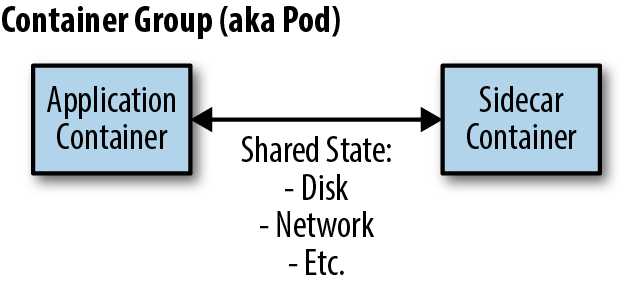

# Kubernetes Logging
## Containers and Logging

Containerized applications typically direct application logs to STDOUT. The container runtime traps these logs and does something with them - typically writes to a file. Where these files are stored depends on the container runtime and configuration.

> One fundamental difference with Windows pods is they do not generate STDOUT. 

One can run some solution to retrieve the ETW (Event Tracing for Windows), Windows Event Logs and other application specific logs from running Windows containers and pipes formatted log output to STDOUT. 

These logs can then be forwarded using to the desired destination such as Amazon CloudWatch.

The Log collection mechanism retrieves STDOUT/STDERR logs from Kubernetes pods. A "Daemon Set" (aka Agent or sidecar) is a common way to collect logs from containers. 

## Kubernetes logging architecture

According to the [Twelve-Factor App manifesto](https://12factor.net/), which provides the gold standard for architecting modern applications, containerized applications [should output their logs to stdout and stderr](https://12factor.net/logs). This is also considered best practice in Kubernetes and cluster level log collection systems are built on this premise.

### The Kubernetes logging architecture defines three distinct levels:

1. Basic level logging: the ability to grab pods log using kubectl (e.g. kubectl logs myapp – where "my_app" is a pod running in "my_cluster")
1. Node level logging: The container engine captures logs from the application’s stdout and stderr, and writes them to a log file.
1. Cluster level logging: Building upon node level logging; a log capturing agent runs on each node. The agent collects logs on the local filesystem and sends them to a centralized logging destination like Elasticsearch or CloudWatch. The agent collects two types of logs:
  - Container logs captured by the container engine on the node.
  - System logs.

Kubernetes, by itself, doesn’t provide a native solution to collect and store logs. It configures the container runtime to save logs in JSON format on the local filesystem. Container runtime – like Docker – redirects container’s stdout and stderr streams to a [logging driver](https://docs.docker.com/config/containers/logging/configure/). 

In Kubernetes, container logs are written to `/var/log/pods/*.log` on the node. Kubelet and container runtime write their own logs to `/var/logs` or to [**journald**](https://www.loggly.com/blog/why-journald/). Then cluster-wide log collector systems like [**Fluentd**](https://en.wikipedia.org/wiki/Fluentd) can tail these log files on the node and ship logs for retention. These log collector systems usually run as DaemonSets on worker nodes. But running [**DaemonSets**](https://kubernetes.io/docs/concepts/workloads/controllers/daemonset/) is not the only way to aggregate logs in Kubernetes.

## Forwarding k8s container logs 

There are three common approaches for capturing logs in Kubernetes:

- **Node level agent**, like a [Fluentd daemonset](https://docs.aws.amazon.com/AmazonCloudWatch/latest/monitoring/Container-Insights-setup-logs.html). This is the recommended pattern.
- **Sidecar container**, like a [Fluentd sidecar container](https://www.middlewareinventory.com/blog/kubernetes-sidecar-logging-with-fluentd-to-efk/).
- **Directly writing to log collection system**. In this approach, Container log drivers are used. They forward the logs to the "sidecar container". That solution requires the run time environment where the final Logging is to be found.

> The principle of separation of concerns: logging implementation should be independent of the application. Doing so allows change of the logging infrastructure without impacting or changing the application.

If only a need to capture basic logging at the pod-level is a requirement, `kubectl` logs will do without any application refactoring.

# Appendix A:

## The Sidecar Pattern

The sidecar pattern is a single-node pattern made up of two containers. The first is the application container. It contains the core logic for the application. Without this container, the application would not exist. In addition to the application container, there is a sidecar container. The role of the sidecar is to augment and improve the application container, often without the application container’s knowledge. 

In its simplest form, a sidecar container can be used to add functionality to a container that might otherwise be difficult to improve. Sidecar containers are residing as an atomic container group, such as the `pod` object in Kubernetes. 

In addition to being scheduled on the same machine, the application container and sidecar container share a number of resources, including parts of the filesystem, hostname and network, and many other namespaces. 

## Appendix B:

[Windows containers in Kubernetes](https://kubernetes.io/docs/setup/production-environment/windows/intro-windows-in-kubernetes/)

> One fundamental difference with Windows pods is they do not generate STDOUT. 

