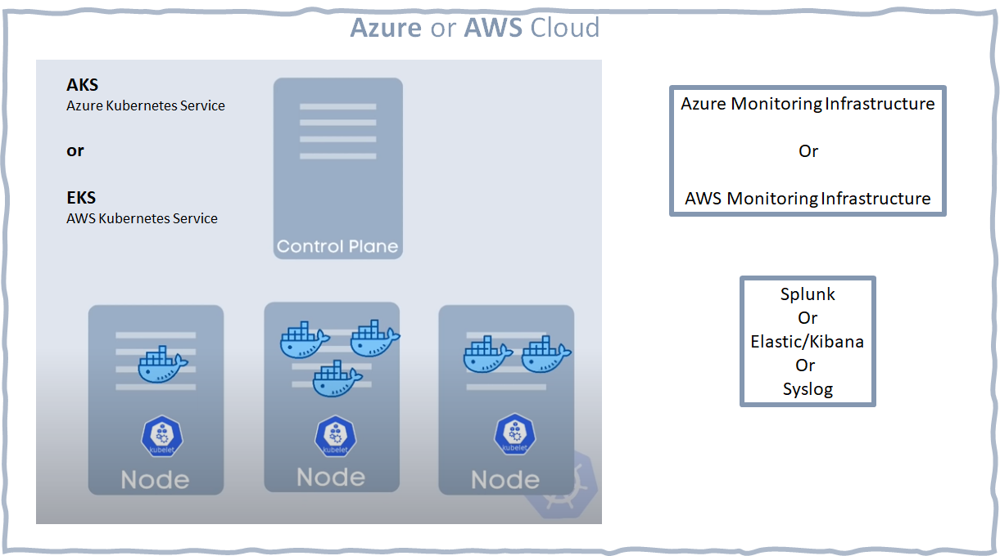
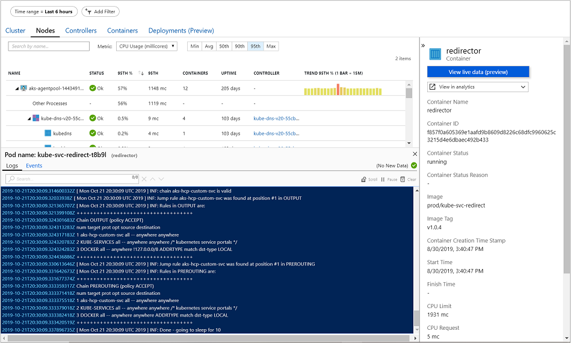
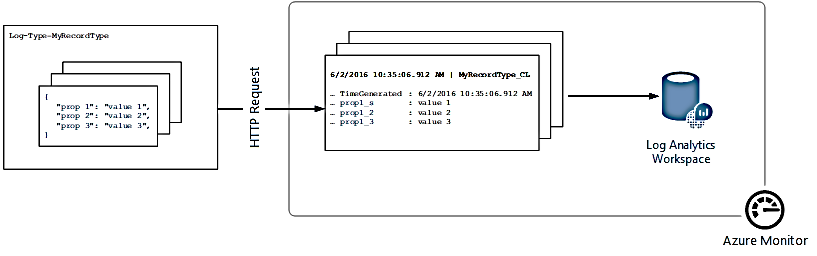
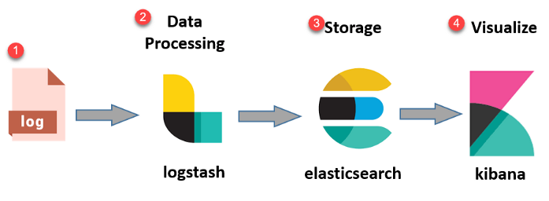
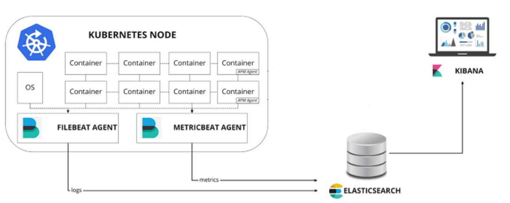
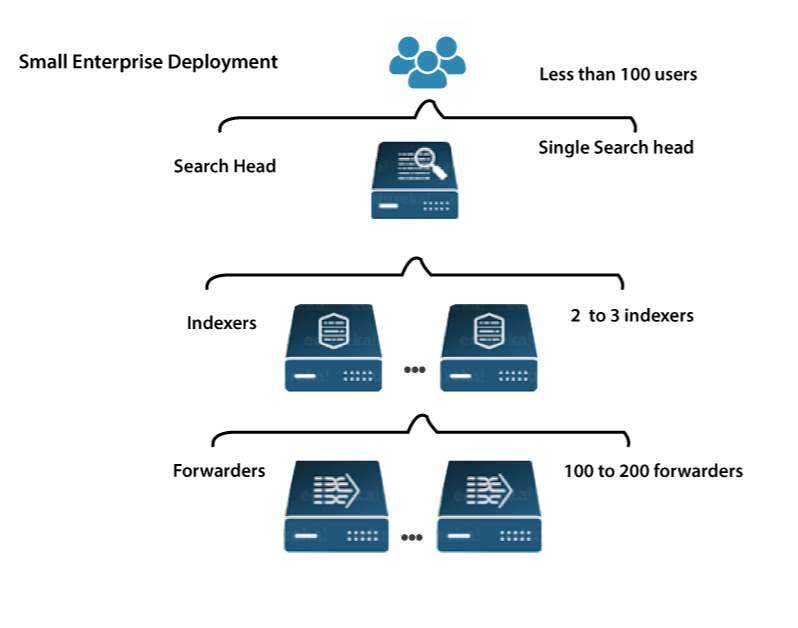
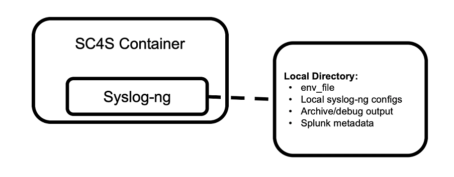
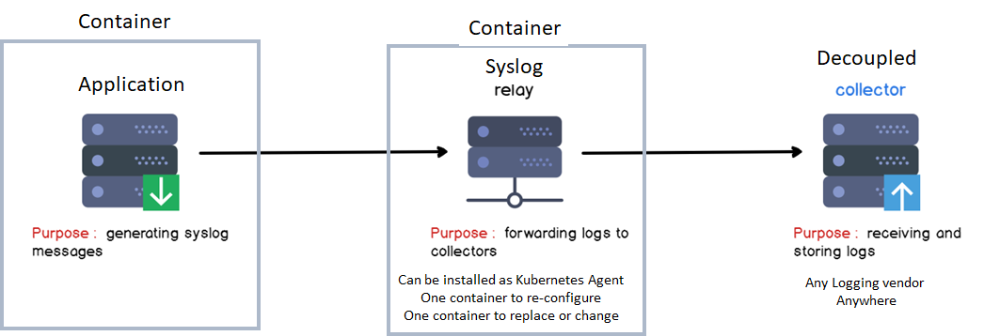

<h1>Modern FA Logging infrastructure</h1>
<h2>Introduction</h2>

Version: 0.1.20200311 -- WORK IN PROGRESS

# Key assumptions

- Cloud
  - Azure or AWS
- Kubernetes (k8s)
  - AKS or EKS
- Docker Containers
  - Linux and Windows 

Those are key constraints shaping up the research and suggested solutions. This is the base common architecture.



Key Observations

- There is no VM's (**TODO**: check on this one)
- k8s controls the k8s topology
- One node is usualy one VM (recommendation)
- Nodes and Pods "appear and disappear" dynamicaly
  - Nodes contain Pods  
    - Pod is abstraction; it "contains" Containers
      - recommendation is `1 : 1`; one pod one container

### Common to Logging / Monitoring

Kubernetes logging can be divided into control plane logging, node logging, and application logging. The Kubernetes control plane is a set of components that manage Kubernetes clusters and produce logs used for auditing and diagnostic purposes.

Kubernetes also runs system components such as `kubelet` and `kube-proxy` on each Kubernetes node that runs pods. These components write logs within each node. 

Both AKS and EKS do contain k8s Monitoring and Logging. Primarily oriented towards Administrator and Operators.

Syslog is standard logging infrastructure. Third party providers do use it. 

### The Deprecation of a Docker Runtime

<!-- https://semaphoreci.com/blog/kubernetes-vs-docker -->

*Docker support in the kubelet is now deprecated and will be removed in a future release.*

EOF 2021 Kubernetes development team announced they are [deprecating Docker support](https://github.com/kubernetes/kubernetes/blob/master/CHANGELOG/CHANGELOG-1.20.md#deprecation).

[Kubernetes is Moving on From Dockershim, on April 2022](https://kubernetes.io/blog/2022/01/07/kubernetes-is-moving-on-from-dockershim/): Commitments and Next Steps.

("Dockershim" is a process through which Kubernetes is communicating with Docker runtime aka `dockerd`. Support will last for one year after Apr 2022.)

Docker runtime is made of two parts:

1. dockerd
   1. Manages: Network, API, Storage, Images, Builds
2. containerd
   1. Manages Container

Why the Docker runtime removal (deprecation):

1. Kubernetes wants to support and run any container conforming to the OCI ( [Open Container Initiative ](https://opencontainers.org/)) 
1. Not just Docker specific containers

The result is less bloat and fewer dependencies.

### Why do we care?

If using managed k8s cluster on a cloud provider like AWS EKS, Google GKE, or Azure AKS, need to check AKS,EKS runtime before Docker support goes away. 

k8s support "Container Insights" and that include `stdout`/`stderr` of containers. It is a moot point how will reading the Docker Container logs be affected on AKS or EKS. Do they (and how much) depend on Docker runtime that will be removed? 

<!-- div class="page"/ -->

# Azure AKS Containerized App's logging

Out of the box (OOB) AKS uses so called "Conainer insights" concept and mechanism. Container insights primary reason of existence is advanced diagnostic feature allowing [direct access to AKS container logs (stdout/stderror), events, and pod metrics](https://docs.microsoft.com/en-us/azure/azure-monitor/containers/container-insights-livedata-overview). 

It exposes direct access to `kubectl logs -c`, `kubectl get events`, and `kubectl top pods`. Please not these are k8s, not docker runtime commands. 

Azure console dash board shows the logs, events, and metrics generated by the container engine to further assistance in troubleshooting issues in real-time.



### Issues

- That meachanism is described as: *Viewing real-time log data as they are generated by the container engine from the Nodes, Controllers, and Containers view*. 
  - Team will need acces to live (test) AKS installation to confirm or deny.
- Usability of the  solution is somewhat moot point too.
  - Azure portal is usualy accessible only to a limited number of Azure administrators 
  - That screen above is not just another web site. Access to it highy controlled
- The whole solution might require establishing spearate FA operators and users groups and authorizations for different roles, with good knowledge and integration with company AAD (Azure AD).

## Windows Containers and Azure 

<!-- https://samcogan.com/windows-containers-and-azure -->

Windows containers are only for situations where project must run the containerized application on Windows. This is down to some key limitations in Windows containers.

- **Size**: smallest Windows container is around 3GB. 
- **OS Version**: Windows containers do require that the host machine is running the same version of Windows as it is inside the container. Not the same family, but the same version. If host is running Server 2016 v1803, then containers also need to run Server 2016 v1803, not v1709. This is very problematic as it means rebuilding images any time host OS changes. For those trying to use cloud providers, users won’t know what OS is running on the machines windows containers will be running on. 
  - One can combat this issue by running Windows containers as HyperV containers, which wraps container in a thin virtual machine to abstract it from the OS. 
  - This adds complexity and it is not certain what are the Azure services and requiremenrs necessary

- **AKS**: what version and build number is required for Windows containers running on AKS?
  - In May 2019 AKS Windows Containers was in "preview mode"
  - It seems Windows Server 2022 is in the focus 2022Q2, of the Azure (AKS) development team
    - Just before that it was Windows Server 2019
- **ACI** (Azure Container Instances): ACI is container as a service platform, which allows projects to create a container as a top-level resource in Azure quickly. There is no need to manage underlying VMs or even an orchestrator.
  - Limitations to be aware of
    - ACI is more expensive than running a VM of the same size. ACI is intended for burst workloads that are running for short periods. ACI instance 24/7, will cost more than running a VM of the same size (but project don’t need to worry about the underlying VM management)
    - When launching an ACI, system need to download the container image; there is no caching of images. That means the large size of Windows containers can become a problem, especially if system is regularly killing and recreating instances. Each time system does that the image is re-downloaded.
    - Windows Containers on ACI do not currently support joining a virtual network. 
      - One can do this with Linux CI instances, but not Windows.
- **Azure Service Fabric** is a Azure platform recommended for Micro Services built Azure applications
  - To run Windows containers in production today, with them joined to a virtual network, the only option that ticks all these boxes is Service Fabric (SF). SF is Microsoft’s microservices platform which can host both executables and containers. It supports both Linux and Windows containers (but not in the same cluster).
    - Service Fabric is a “PaaS like” solution, like AKS, where it is still deploying IaaS VM’s but with easy ways to manage and update them. 
      - Teams are still responsible for managing and administrating those machines. 

### Situation 2022Q2

Circa 2022Q2, customers can choose from Azure Container Instances, Service Fabric managed clusters, or Azure Kubernetes Service to migrate their on premises workloads. 

- Customers that want to deploy serverless containers quickly and easily would benefit from Azure Container Instances. 
- Customers that want additional control over their environment would benefit from Azure Kubernetes Service which offers an industry leading managed Kubernetes offering. 
- Lastly, customers who want all the richness that comes with Service Fabric such as stateful programming models can use Service Fabric managed clusters which offer the entire Service Fabric feature set with reduced cluster management overhead. 

### Native Azure and Container Logs 

Microsoft Azure by default, without Kubernetes (AKS), has many monitoring options to choose from, making it difficult to decide which ones to rely on to track workloads and performance demands. Outside of AKS, Azure does offer extensive monitoring capabilities, a bit less extensive logging, while "ad hoc logging" from inside Containers seems very difficult to use, compared to AWS and Google Clouds. ["Data Collector API"](https://docs.microsoft.com/en-us/azure/azure-monitor/logs/data-collector-api) is the current solution (in preview status) for sending "Ad hoc" logs to Azure. 



The key issue with that is [users need to define a custom record type](https://docs.microsoft.com/en-us/azure/azure-monitor/logs/data-collector-api) when submitting data through the (Azure Monitor HTTP) Data Collector API. Currently, users can't write data to existing record types that were created by other data types and solutions.

That solution requires new code to be written and it is not using Container logs.

If inside a container, code using "Data Collector API" will be connecting to Azure over HTTP REST calls, bypasing container logs. There are no Azure Docker log drivers matching [Amazon Cloud Watch loggin driver](https://docs.docker.com/config/containers/logging/awslogs/), for example.

# AWS Cloud Watch Logging for Amazon EKS

CloudWatch collects monitoring and operational data in the form of logs, metrics, and events. That is how AWS dash boards offer complete visibility resources, applications, and services running on AWS and on-premises.

### Mechanism to captured and send to Cloud Watch
- Agent: CW Container Insights implements cluster, node, and pod-level metrics with the CloudWatch agent.
- EKS uses Fluent Bit or [Fluentd](https://www.fluentd.org/architecture) for log capture to CloudWatch.
  - Docker offers OTB Fluentd logging driver

If users don’t want to use Container Insights with Fluent Bit or Fluentd for logging, users can capture node and container logs with the CloudWatch agent installed on Amazon EKS nodes. Docker also has OTB [CloudWatch logging driver](https://docs.docker.com/config/containers/logging/awslogs/) 

The awslogs logging driver sends container logs to Amazon CloudWatch Logs. Log entries can be retrieved through the AWS Management Console or the AWS SDKs and Command Line Tools.


### Risks

It seems AWS logging driver works only while container is running on the EKS on the Amazon cloud. This is its sample configuration:
```
{
  "log-driver": "awslogs",
  "log-opts": {
    "awslogs-region": "us-east-1"
  }
}
```
That configuration probably can not run on the developers laptop.

[It is not clear but it is likely](https://docs.aws.amazon.com/prescriptive-guidance/latest/implementing-logging-monitoring-cloudwatch/kubernetes-eks-logging.html), docker container Cloud Wach driver communicates with the CW agent on the k8s node on which it runs.

# ELK aka Elastic Search and Kibana

<!-- https://itnext.io/deploy-elastic-stack-on-kubernetes-1-15-using-helm-v3-9105653c7c8 -->
The Elastic Stack (also known as ELK) integrates natively with Kubernetes and is a popular open-source solution for collecting, storing and analyzing Kubernetes telemetry data and application logs.

Overview of the standard ELK logging solution



1. Logs: Server logs to be analyzed are identified
1. Logstash: Data aggregation and processing
1. Elasticsearch: Indexing and storage
1. Kibana: Analysis and visialization

### Elasticsearch on Kubernetes

According to Elastic, (a company brhind ELK stack), these are just a few of the benefitss:
- Straightforward deployment and management of multiple Elasticsearch clusters, including Kibana
- Seamless upgrades to new versions of the Elastic Stack
- Simple scaling that allows you to grow with your use cases
- Default security on every cluster

Elastic provide the option to have the Elasticsearch & Kibana on Kubernetes running on the Elastic Cloud managed solution.



Iin that scenario there are two ELK related agents on each Kubernetes node.

- [Filebeat](https://www.elastic.co/beats/filebeat) is a lightweight shipper for forwarding and centralizing log data. Installed as an agent on nodes, monitors the log files or locations.
  - [Filebeat for Kubernetes](https://www.elastic.co/guide/en/beats/filebeat/current/running-on-docker.html) is a Docker image.
- [Metricbeat](https://www.elastic.co/guide/en/beats/metricbeat/current/metricbeat-installation-configuration.html) monitors k8s nodes and the pods they host by collecting metrics from the operating system and services.
  - [k8s Metricbeat agent](https://www.elastic.co/gimplmenteduide/en/beats/metricbeat/current/running-on-kubernetes.html) is implemented as a Docker Image.

### ELK on AKS or EKS
There is a number of vendors offering ELK management and integration with AKS or EKS clusters.

# Splunk

Splunk is an enterprise level suite of tools and technologies for logging data collection, management and visualisation. Standard Splunk Enterprise architecture is based on layers of VM's for collecting , indexing and searching logging data.



That cluster is external to the AKS or EKS clusters hosting the business app's.

For "Log Forwarding" from Kubernetes, Splunk [OpenTelemetry Collector](https://opentelemetry.io/docs/collector/getting-started/) for Kubernetes is k8S agent implemented as Docker Image. Its instantiation creates a Kubernetes DaemonSet along with other Kubernetes objects in a Kubernetes cluster and provides a unified way to receive, process and export metric, trace, and log data for:

- Splunk Enterprise
- Splunk Cloud Platform
- Splunk Observability Cloud

This option for Kubernetes data, based on the OpenTelemetry Collector, has > 10x performance over the classic Fluentd-based Splunk Connector for Kubernetes.

### Development using Splunk

For testing and evelopment apparently there is a Splunk Docker [image for single machines](https://www.splunk.com/en_us/blog/platform/announcing-splunk-on-docker.html).

[Splunk Connect for Syslog](https://splunkbase.splunk.com/app/4740/) aka SC4S, is a containerized [Syslog-ng](https://www.syslog-ng.com/) server with a configuration framework designed to simplify getting syslog data into Splunk Enterprise and Splunk Cloud. This approach provides an agnostic solution allowing administrators to deploy using the container runtime environment of their choice



Note: configuration of that log forwarder is [not simple](https://www.splunk.com/en_us/blog/tips-and-tricks/splunk-connect-for-syslog-turnkey-and-scalable-syslog-gdi-part-3.html). 

# Syslog 

[Syslog](https://en.wikipedia.org/wiki/Syslog) is logging standard and logging infrastructure protocol.



That are the three components of the syslog infrastructure. Overlaid with the Containers concept. Some standard valid toplogies (from RFC3164):

```
+------+         +---------+
|Device|---->----|Collector|
+------+         +---------+

+------+         +-----+         +---------+
|Device|---->----|Relay|---->----|Collector|
+------+         +-----+         +---------+

+------+     +-----+            +-----+     +---------+
|Device|-->--|Relay|-->--..-->--|Relay|-->--|Collector|
+------+     +-----+            +-----+     +---------+

+------+         +-----+         +---------+
|Device|---->----|Relay|---->----|Collector|
|      |-\       +-----+         +---------+
+------+  \
           \      +-----+         +---------+
            \-->--|Relay|---->----|Collector|
                  +-----+         +---------+

+------+         +---------+
|Device|---->----|Collector|
|      |-\       +---------+
+------+  \
           \      +-----+         +---------+
            \-->--|Relay|---->----|Collector|
                  +-----+         +---------+

+------+         +-----+            +---------+
|Device|---->----|Relay|---->-------|Collector|
|      |-\       +-----+         /--|         |
+------+  \                     /   +---------+
           \      +-----+      /
            \-->--|Relay|-->--/
                  +-----+
```
Initialy Syslog was invented for logging from network devices.  These days it is used for "everything".

Syslog has started in 1980's. Circa 2022 there is basically two syslog ecosystems:

- [syslog-ng](https://en.wikipedia.org/wiki/Syslog-ng)
- [rsyslog](https://en.wikipedia.org/wiki/Rsyslog)

### Syslog Forwarding 

As already shown is log transport tool used to forward system, command, and event logs to an external monitoring system. 

There are [a lot of Docker images](https://pkgs.alpinelinux.org/packages?name=*syslog*) used to implement log forwarding to various major logging aggregators.

### The Benefits

- syslog should work on either AKS or EKS without any special AKS/EKS requirements to be satisfied
- it is a standard gateway to/from any logging system of choice
- All major Logging software vendors offer syslog conection, delaying and aggregation
- That is a major win decoupling from logging infrastructure and thus allowing for different customers using different logging solutions

### The issues

The fact that Syslog is UDP-based means there can be issues with reliability. On the other hand, as systems become more complex, it becomes increasingly important to collect and monitor all relevant data produced by applications.


