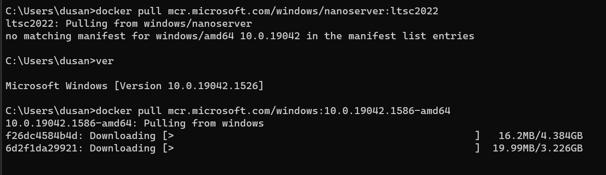
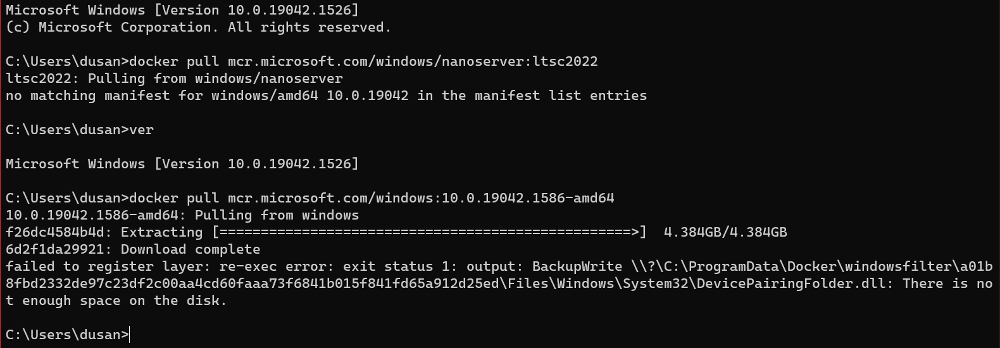
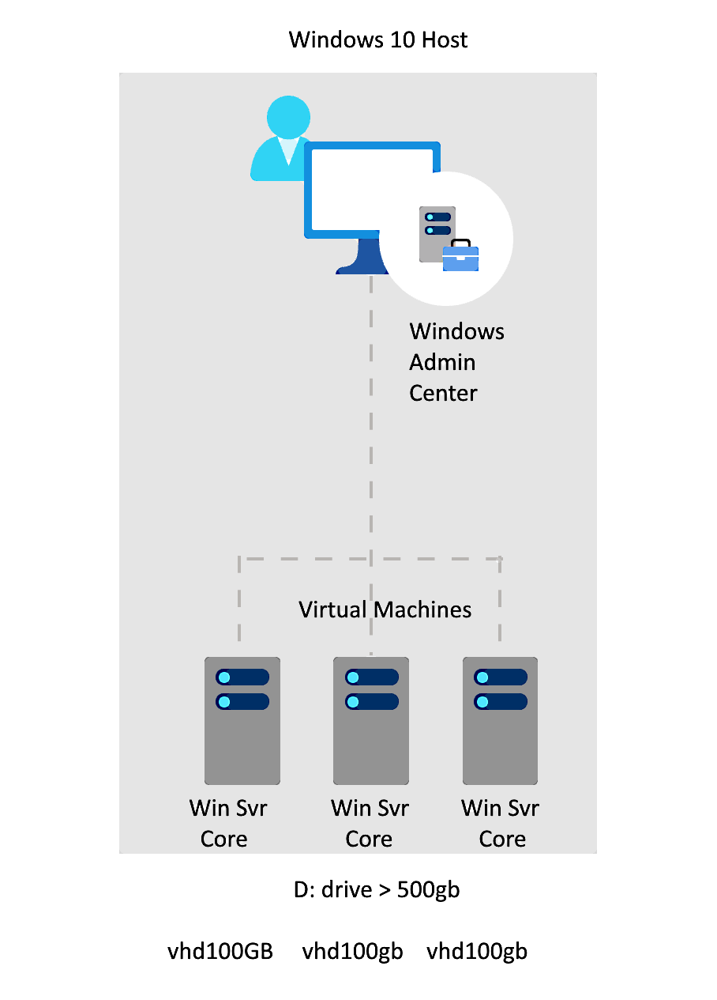
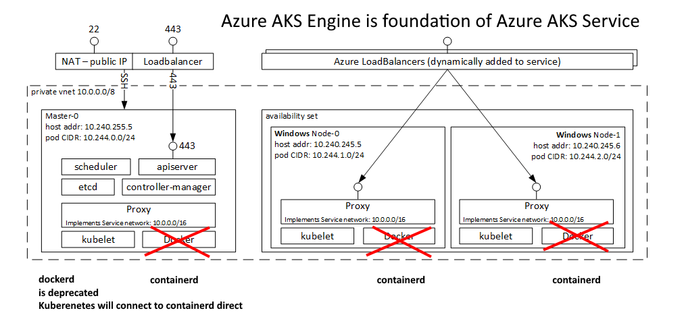

## Warnings and Reality Checks

### Do not compress a Windows System drive

If system drive is compressed, the following folders must be uncompressed for Hyper-V containers to run:

- C:\ProgramData\Microsoft\Windows\Hyper-V\Container Images Store
- C:\ProgramData\Microsoft\Windows\Hyper-V\Conttainer Utility VM
- C:\ProgramData\Docker\windowsfilter

If they are compressed, Docker will fail to launch the container. It is a moot point if this is still the issue 2022Q2?

### Use Windows server in a VM 

<!-- https://blog.sixeyed.com/getting-started-with-docker-on-windows-server-2019/ -->

You need Windows Server to run "pure" Docker containers, where the container process runs directly on the host OS. You can use the same Docker images, the same Dockerfiles and the same docker commands on Windows 10, but there's an additional virtualization overhead, so it's good to use a Windows Server VM for test environments.

### What about images FROM scratch ?

Sharp eyed docker beginners always ask: Why these huge Windows images? Why not just use the "FROM scratch" feature in a Docker file? 

Answer is very simple: "FROM scratch" does not work in a Docker that is switched to Windows Containers. (Try) And you need to switch the Docker to Windows mode, to be able to run containers with windows images, aka "Windows Containers".

## Testing Windows Container locally

1. Switched to Docker Desktop for Windows Containers
2. Going to test [ETW logging driver](https://docs.docker.com/config/containers/logging/etwlogs/)

## Huge system drive is needed  

In order to be used, Windows Container images must match host machine windows build number. THus bellow, I had to use the Windows10 image that matches my laptop build number.

   
   That image is positively huge. After several hours this is usually the outcome:
   

- It is very difficult (or impossible) to move windows docker installation. 
  - docker images images pulled take space on system drive. 

### Windows Server Core VM is warmly advised

  - Install [windows core svr as a VM](https://www.youtube.com/watch?v=hzZPy4RhL-0) on any other drive, not `C:`.
    - it is a small and fast VM
  - Inside it install the docker and experiment further
  
- On a host machine it is a very good advice to use [Windows Admin Center](https://docs.microsoft.com/en-gb/windows-server/manage/windows-admin-center/plan/installation-options)
    - Great for quick start, testing, ad-hoc or small scale scenarios.
  - I have [installed](https://docs.microsoft.com/en-gb/windows-server/manage/windows-admin-center/deploy/install) it on a local Windows 10 client (laptop) that has connectivity to the managed server, actually a VM runing on the same machine. 

Windows 10 host with 3 local Windows Server Core VM's

<!-- ## If and When will AKS follow Kubernetes in deprecating Docker runtime?

- Currently unknown
- [**Kubernetes Cluster API Provider Azure**](https://github.com/kubernetes-sigs/cluster-api-provider-azure)
  - Circa 2022 Q1 that is not for production use. 
- [Roadmap](https://capz.sigs.k8s.io/roadmap.html) is a bit out of dater and does not seem concerned with tight Kubernetes compatibility

- Focus is on Windows Serve 2022 [What’s new for Windows Containers on Windows Server 2022](https://techcommunity.microsoft.com/t5/containers/what-s-new-for-windows-containers-on-windows-server-2022/ba-p/2167036), used with containers

###  AKS Engine is DEPRECATED

- Azure AKS is implemented on top of AKS Engine open source product
  - It is possible to instal [AKS Engine on Windows on Azure VM](https://github.com/Azure/aks-engine/blob/master/docs/topics/windows.md)
- (Assumption about a) **Crucial "detail"** 
    - Image [source](https://github.com/Azure/aks-engine/blob/master/docs/static/img/kubernetes-windows.png)
    - AKS Engine will have to be changed to follow Kubernetes decision to deprecate the Docker runtime by April 2022, and use just docker container run time (aka containerd). Here is the change required:

    
    - that way Azure AKS service also, should be compatible with Kubernetes after April 2023.
    - That change should not affect the AKS installations prior to that date.
      - Emphasize is on **"should"**.
- **Alternatively** Microsoft might postpone that change
  - Possibly because the transition might not go as planed. 
- We do not know the details since we do not have the view of the AKS foundations any more? -->

---

&copy; 2022 by dbj@dbj.org, CC BY SA 4.0
