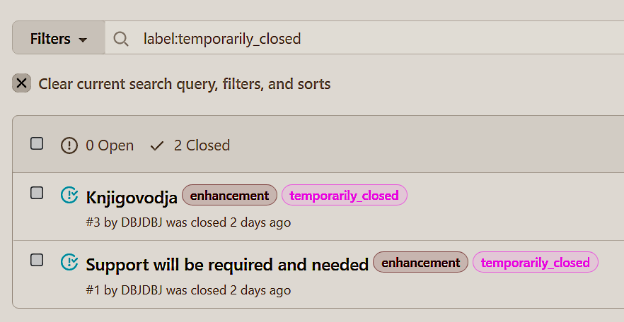

# https://glosos.com

How do we *develop a project*?

**Imagine spiral staircase. That is it.** 

Github allows for Fluid but Controlled project development. 

1. engage in project [issues](https://github.com/DBJDBJ/glosos/issues)
   1. After few weeks, try and learn [issues search](https://docs.github.com/en/github/searching-for-information-on-github/searching-on-github/searching-issues-and-pull-requests)
      1. in your own time. It is really simpler than it looks
      2. Example: search by label  
      
      This will make your life much easier when there are hundreds of issues.
      3. There are all sort of [searching functionality](https://docs.github.com/en/github/searching-for-information-on-github/searching-on-github) on GitHub.
   2. Making issues the right size is an art. It takes few weeks. Don't worry.
2. Please engage in discussions (online)
   1. Suggestion is to start engaging from [Discussion](https://github.com/DBJDBJ/glosos/discussions).
3. Please make sure you have reviewed all the material in the folders here.
   1. Some is relevant to your project role, some is not
2. Please learn some MARK DOWN formatting.
   1. Here is a [crash course doc](./howto/formating_help.md).

| Person ID | Full Name    | Role
|-----------|--------------|----------
| BNP | Bojana N. Papovic  | Owner
| DBJ | Dusan B. Jovanovic | Developer
|     |                    | Architect

