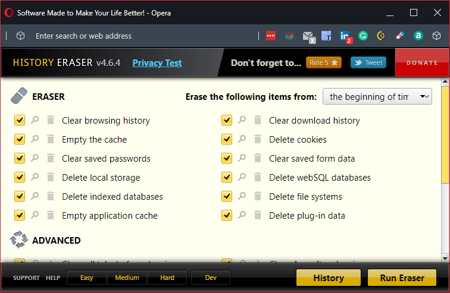

# STOP

There is a problem with this plugin. Please wait for a resolution

# What is a problem

The site contains hundreds of details to be (re)adjusted and set right. And al of them are changing frequently until the team is satisfied.

> To see the latest of the stream frequent updates (of the site) can be tricky

# What is a solution

To overcome that issue one has to clear the local browser cache **completely**, before being able to see the latest updates.

For clearing that cache we recommend "HISTORY ERASER".

Please make sure [HISTORY ERASER](https://www.hotcleaner.com/history-eraser-chrome-extension-app.html) is installed on your machine and attached to the browser you use.

Installation is not straight forward. Here is the [Chrome Extension in a zip](./HistoryEraser_Latest.zip), from this repository you are using right now.

That can be installed in: Chrome, Edge and Opera. If not sure how to install browser extension having a zip file please ask.
