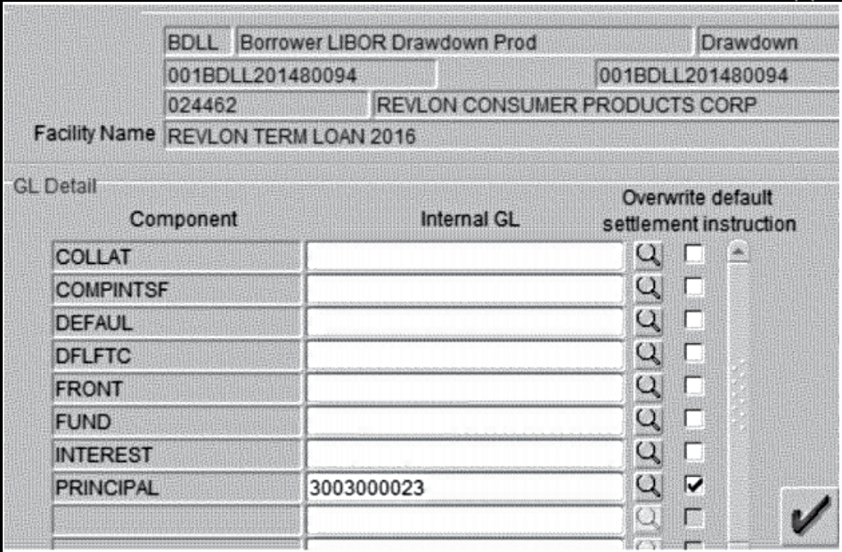

# Citibank just got a $500 million lesson in the importance of UI design

[[Source](https://arstechnica.com/staff/2021/12/the-20-most-read-stories-of-2021-on-ars-technica/)]

We all know bad user interfaces when we see them. Usually they're just a giant pain in the neck, causing our eyes to dart around the screen trying to figure out which widget or button to press. Unfortunately for Citibank, a nasty UI cost it $500 million.

In the process of refinancing its debt, Revlon enlisted Citibank to send out $7.8 million in interest payments to various creditors. At the same time, Revlon was also refinancing its debt, rolling it into a new loan with better terms. The responsibility of inputting all of the relevant data about the payments and refinancing fell to a subcontractor in India.

"Flexcube" UI. Not at all confusing!

You can see a screenshot of Flexcube, the app used for these transactions, at right. "The subcontractor thought that checking the 'principal' checkbox and entering the number of a Citibank wash account would ensure that the principal payment would stay at Citibank," wrote Tim Lee in our original story. "He was wrong."

Citibank sent out $900 million in payments instead of $7.8 million. While the bank was able to recover funds from willing creditors, it had to sue to get the remainder back, which didn't work.